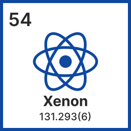
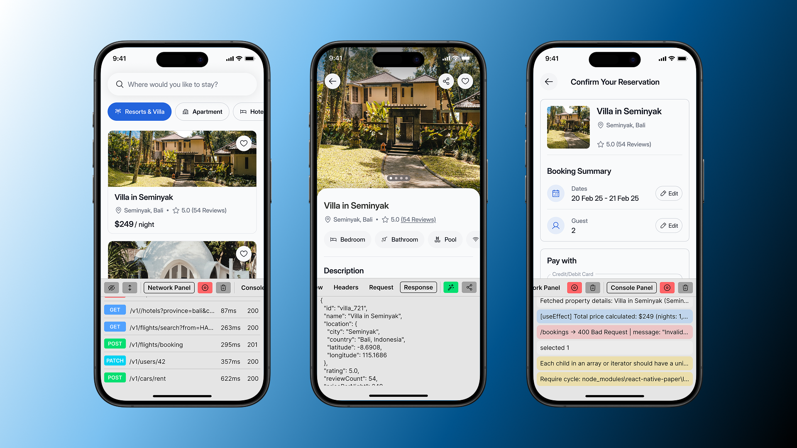

<div align="center">



# React Native Xenon

### A powerful in-app debugging tool for React Native.

</div>

<div align="center">

[![GitHub Actions Workflow Status][github-actions-status-badge]][github-actions-status-link]
[![NPM Version][npm-version-badge]][npm-version-link]
[![React Native][react-native-badge]][react-native-link]
[![Runs With Expo][expo-badge]][expo-link]
[![Types Included][typescript-badge]][typescript-link]
<br />
[![GitHub License][github-license-badge]][github-license-link]
[![NPM Downloads Per Month][npm-downloads-per-month-badge]][npm-downloads-per-month-link]
[![Buy Me A Coffee][buy-me-a-coffee-badge]][buy-me-a-coffee-link]

</div>

## Features

- :iphone: **In-app debugging** – Debug apps in any environment without the need for debug builds.
- :globe_with_meridians: **Network Inspection** – Monitor HTTP(S) requests (XHR, Fetch) and WebSocket connections.
- :page_with_curl: **Log Capture** – Intercept console messages like log, info, warn, and error for enhanced debugging.
- :zap: **Draggable Bubble UI** – Seamlessly debug without disrupting your workflow.
- :sparkles: **React Native & Expo Support** – Built for compatibility across both platforms.

## Screenshots



## Supported react-native versions

| **react-native-xenon version** | **react-native version** |
| ------------------------------ | ------------------------ |
| 2.1.0+                         | 0.80.0+                  |
| 1.0.0+                         | 0.73.0+                  |

## Installation

### Expo

If you are using Expo, just run this command and you're done. No additional configuration required.

```sh
npx expo install react-native-xenon react-native-safe-area-context react-native-screens
```

### React Native

For bare React Native projects, install the packages and follow the additional peer dependency installation steps below.

```sh
yarn add react-native-xenon react-native-safe-area-context react-native-screens
```

> [!NOTE]
> **React Native Screens** needs extra steps to finalize its installation, please follow their [installation instructions](https://github.com/software-mansion/react-native-screens?tab=readme-ov-file#installation).

#### iOS

Don't forget to install pods when you are developing for iOS.

```sh
cd ios && pod install; cd ..
```

## Usage

Wrap your top-level component with `<Xenon.Wrapper />`.

```tsx
import Xenon from 'react-native-xenon';

function AppContainer() {
  return (
    <Xenon.Wrapper>
      <App />
    </Xenon.Wrapper>
  );
}
```

Present the debugger by calling the `show` method.

```tsx
Xenon.show();
```

And hide it by calling the `hide` method.

```tsx
Xenon.hide();
```

## Props

| **Prop**                    | **Type**   | **Description**                                                                                                                               |
| --------------------------- | ---------- | --------------------------------------------------------------------------------------------------------------------------------------------- |
| `disabled`                  | `boolean`  | If true, completely disables the debugger by rendering only the children components without any debugging functionality. Defaults to `false`. |
| `autoInspectNetworkEnabled` | `boolean`  | Determines whether the network inspector is automatically enabled upon initialization. Defaults to `true`.                                    |
| `autoInspectConsoleEnabled` | `boolean`  | Determines whether the console inspector is automatically enabled upon initialization. Defaults to `true`.                                    |
| `bubbleSize`                | `number`   | Defines the size of the interactive bubble used in the UI. Defaults to `40`.                                                                  |
| `idleBubbleOpacity`         | `number`   | Defines the opacity level of the bubble when it is idle. Defaults to `0.5`.                                                                   |
| `includeDomains`            | `string[]` | Domains to include in network interception. Defaults to all domains.                                                                          |

<br />

> [!IMPORTANT]
> The debugger is enabled by default in all environments including production. To prevent exposing sensitive developer tools to end users, always set disabled={true} in production builds (e.g., disabled={isProduction}).

## Methods

| **Method**    | **Return Type** | **Description**                                                                             |
| ------------- | --------------- | ------------------------------------------------------------------------------------------- |
| `isVisible()` | `boolean`       | Checks whether the debugger is currently visible.                                           |
| `show()`      | `void`          | Makes the debugger visible. If it is already visible, this method has no additional effect. |
| `hide()	`      | `void`          | Hides the debugger. If it is already hidden, this method has no additional effect.          |

## Examples

To try out Xenon, you can run the example project:

```sh
# Clone the repo
git clone https://github.com/purrseus/react-native-xenon.git
cd react-native-xenon

# Install dependencies
yarn install

# Start the Expo development server
yarn example start
```

See the [example](./example) directory for more information.

## Contributing

See the [contributing guide](CONTRIBUTING.md) to learn how to contribute to the repository and the development workflow.

## License

This project is [MIT](./LICENSE) licensed.

<!-- badges -->

[github-actions-status-badge]: https://img.shields.io/github/actions/workflow/status/purrseus/react-native-xenon/ci.yml?style=for-the-badge&logo=github&label=%20&labelColor=1B1B1D
[github-actions-status-link]: ./.github/workflows/ci.yml
[npm-version-badge]: https://img.shields.io/npm/v/react-native-xenon?style=for-the-badge&color=CC3F3E&labelColor=1B1B1D&logo=npm&label=%20&logoColor=CC3F3E
[npm-version-link]: https://www.npmjs.com/package/react-native-xenon
[react-native-badge]: https://img.shields.io/badge/%20React%20Native-67DAFB?style=for-the-badge&logo=react&logoColor=67DAFB&labelColor=1B1B1D
[react-native-link]: https://reactnative.dev
[expo-badge]: https://img.shields.io/badge/Expo-FFFFFF?style=for-the-badge&logo=expo&labelColor=1B1B1D&logoColor=FFFFFF
[expo-link]: https://expo.dev
[typescript-badge]: https://img.shields.io/badge/TypeScript-3077C6?style=for-the-badge&logo=typescript&logoColor=3077C6&labelColor=1B1B1D
[typescript-link]: https://www.typescriptlang.org
[github-license-badge]: https://img.shields.io/badge/License-MIT-44CD11?style=for-the-badge&labelColor=1B1B1D
[github-license-link]: ./LICENSE
[npm-downloads-per-month-badge]: https://img.shields.io/npm/dm/react-native-xenon?style=for-the-badge&labelColor=1B1B1D
[npm-downloads-per-month-link]: https://www.npmjs.com/package/react-native-xenon
[buy-me-a-coffee-badge]: https://img.shields.io/badge/%20-Buy%20me%20a%20coffee-FEDD03?style=for-the-badge&logo=buymeacoffee&labelColor=1B1B1D
[buy-me-a-coffee-link]: https://www.buymeacoffee.com/thiendo261
